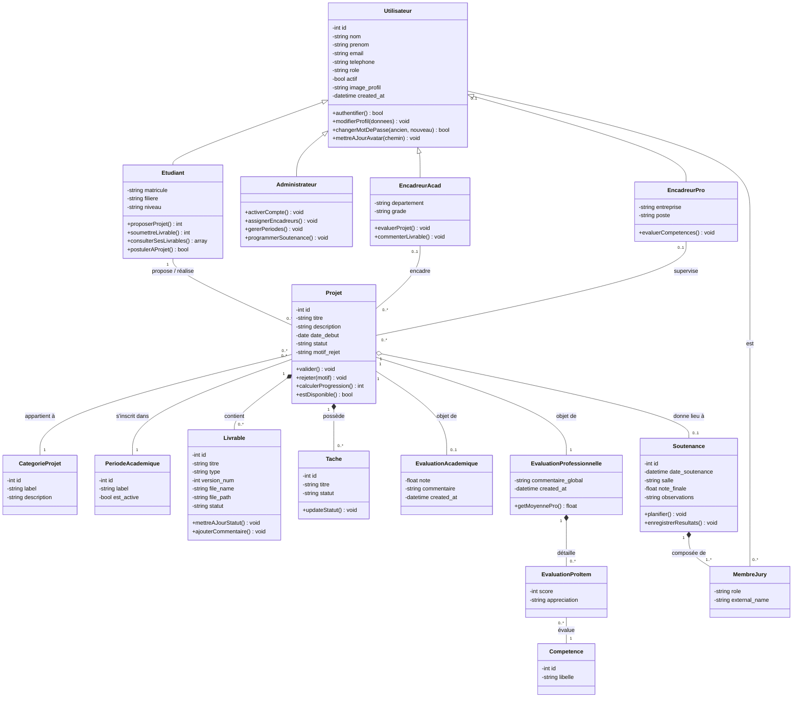

# Diagramme de Classe UML PROJEX (Classification par domaines)

Ce diagramme utilise une classification visuelle pour séparer les différents domaines fonctionnels du système PROJEX.

## Explication du classement

Les classes ont été regroupées par **Domaines Métier** avec un code couleur distinct :

1. **Bleu (Utilisateurs)** : Les acteurs du système et la hiérarchie d'héritage.
2. **Vert (Projet)** : La structure centrale du projet et ses métadonnées (catégorie, période).
3. **Violet (Suivi)** : Les éléments liés à la progression concrète du travail (Livrables et Tâches).
4. **Orange (Évaluations)** : Le système de notation académique et l'évaluation par compétences professionnelles.
5. **Rose (Soutenance)** : L'organisation de l'événement final et la gestion du jury.

Ce classement permet d'identifier immédiatement les responsabilités de chaque classe.
